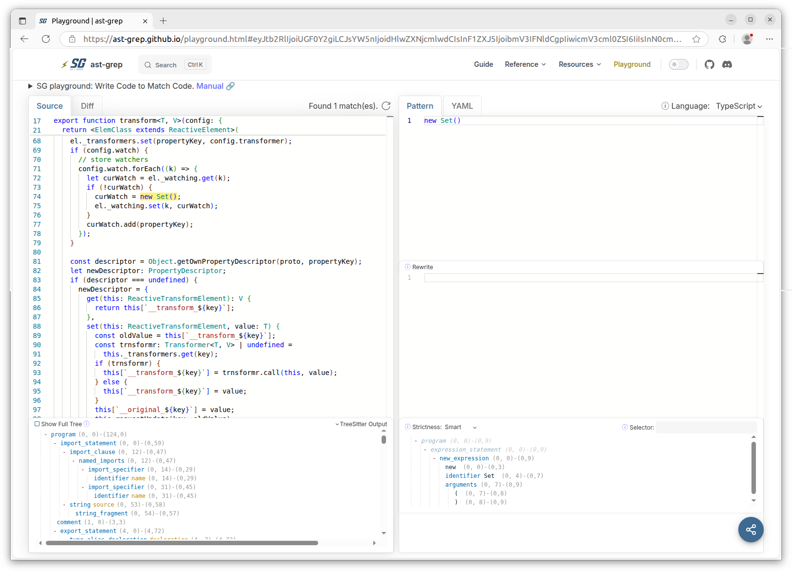

```
rules:
 - id: search-all-functions
   languages:
     - typescript
   message: a message
   pattern: function $FN($ARG)
   severity: ERROR
```

---

Learn X in Y minutes
Where X=YAML
https://learnxinyminutes.com/yaml/



### Matching dynamic content

Using code to find code isn't that useful if you cannot define some dynamic parts.

Seaching you code base for `console.log` calls for the two explicit arguments `"hello"` and `"world"` is not that usefull, but searching `console.log` with ...

```sh
ast-grep scan --inline-rules '
id: no_sss
language: ts
rule:
  pattern: console.log($ONE, $TWO, $$$REST)
' src/state/connection-mixin.ts
```

```
    src/panels/config/voice-assistants/ha-config-voice-assistants-expose.ts
           73┆ @state()
           74┆ @consume({ context: entitiesContext, subscribe: true })
           75┆ _entities!: HomeAssistant["entities"];
            ⋮┆----------------------------------------
           77┆ @state() private _extEntities?: Record<string, ExtEntityRegistryEntry>;
            ⋮┆----------------------------------------
           92┆ @state() private _supportedEntities?: Record<
```

```
    src/common/decorators/transform.ts
           45┆ const keys = new Set<PropertyKey>();
            ⋮┆----------------------------------------
           74┆ curWatch = new Set();
```

```sh
ast-grep run --pattern 'new Set()' --lang ts src
```

```sh
opengrep scan --pattern 'new Set()' --lang ts src
```

```sh
$ opengrep scan --pattern 'act(() => { await jest.advanceTimersByTimeAsync(...) })' --lang ts

┌─────────────────┐
│ 3 Code Findings │
└─────────────────┘

    apps/port-assist/src/features/berth-occupation/components/BerthsOverview/BerthsOverview.test.tsx
           72┆ await act(async () => {
           73┆   await jest.advanceTimersByTimeAsync(500);
           74┆ });

    apps/port-assist/src/features/lock-planning/components/LockObstruction/LockObstruction.test.tsx
          135┆ await act(async () => {
          136┆   await jest.advanceTimersByTimeAsync(10 * 60 * 1000);
          137┆ });

    libs/port-components/src/lib/components/PortFormSubmit/PortFormSubmit.test.tsx
          101┆ await act(async () => {
          102┆   await jest.advanceTimersByTimeAsync(timeout + 1);
          103┆ });
```

```sh
$ opengrep scan --pattern 'act(() => jest.advanceTimersByTime(...))' --lang ts

┌──────────────┐
│ Scan Summary │
└──────────────┘

```

(no matches)

```sh
$ opengrep scan --pattern 'await act(() => jest.advanceTimersByTimeAsync(...))' --lang ts

┌──────────────────┐
│ 52 Code Findings │
└──────────────────┘

    apps/port-assist/src/components/MemUsageReporter.test.tsx
           49┆ await act(() => jest.advanceTimersByTimeAsync(5 * 60_000 + 1));


  apps/port-assist/src/features/announcements/components/ExtendedSearchDialog/ExtendedSearchDialog.test.tsx
          171┆ await act(() => jest.advanceTimersByTimeAsync(501));
            ⋮┆----------------------------------------
            ..
```

`const userEvent = globalUserEvent.setup(...)`

Differ

Each meta-variable is like a wildcard expression than can match a single AST node, when or zero

To distinguish meta-variables from the actual code you wan

A meta-variable like `$ARG` is like a wildcard expression that can match any **single** AST node.

Using a code snippet as a pattern to search for, is called structural search.

It parses your source code into a Abstract / Concrete Syntax Tree (AST / CST), similar to what a compiler does for languages like TypeScript, Java and C#.
After parsing your source code, ast-grep then uses the created Concrete Syntax Tree to do its searching.

**NOTE**: although it's name might make you think otherwise, ast-grep is actually using a CST (superset of an AST) under the hood.

Due to a AST / CST for searching, ast-grep has the following advantages

-
- it's aware of the syntax that its parsed
-

And ast-grep then searching through your code base, it actually searches through a Syntax Tree as opposed to search the text of your code.

By searching

Similar to a compilers / transpiler and linting tools for programming
It the Abstract Syntax Tree (AST), that's like the DOM but for source code, to do its searching.  
And, also it allows you to search on patterns that are declared in the syntax of your programming language.  
Which effectively allows you code to search code :grin:

Our closing brancket problem is a thing of the past when searching code using the Abstract Syntax Tree (AST).
