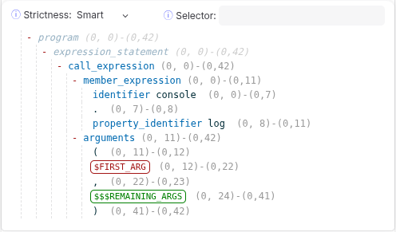
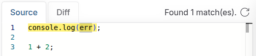
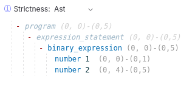

# Workshop: Taking back control of your code

(continues where [02-traditional-search.md](./02-traditional-search.md) file ended)

## Introducing structural search with ast-grep

As shown in the previous section of this workshop, searching code constructs (e.g., a function call) can be troublesome
using literal text and especially with regex.

This is were the tool `ast-grep` comes into play.
The `ast-grep` tool parses your code into an Abstract Syntax Tree (AST), similar to what is done by a compiler,
linting tools (e.g. ESLint, CheckStyle, Ktlint) and code migration tools (jscodeshift, OpenRewrite) do.

But, unlike most linting tools and code migration tools, `ast-grep` does not necessarily require you to have to in-depth
knowledge about your source code in represented as an AST tree.
Using `ast-grep` we can simply use code to find code.

This is called "structural search" and offers a less error-prone alternative to traditional textual search that:

- works no matter how your code is formatted (e.g., code divided on multiple lines).
- always matches the correct closing bracket.

## Searching code using structural search

Let's put `ast-grep` to the test and try it's structural search capabilities to search for `console.log(`..`)` calls in our code base.

First make sure the most recent CLI version of `ast-grep` is installed as explained in the [Installation](https://ast-grep.github.io/guide/quick-start.html#installation) instructions on their website.

**NOTE**: when installing `ast-grep` using NPM, make sure to do a `npm install` of `@ast-grep/cli` and **not** `ast-grep` (a completely different NPM package last published 8 years ago).

🧪 Lets use `ast-grep` to search for `console.log` calls:

```sh
ast-grep --pattern 'console.log()' ../src
```

Notice that `ast-grep` only found `console.log` calls **without** arguments.

🧪 Now try the following:

```sh
ast-grep --pattern 'console.log($ARG)' ../src
```

The search results now only includes `console.log` calls with **exactly** one argument.
But, notice that in the `src/common/string/filter/filter.ts` file the second `)` is now actually included in the search matches.
Regex, eat your heart out!

Additionally, the output of `ast-grep --pattern` is much nicer than `regex-search.sh` since it offers more context showing
whole line of code with matches highlighted in red.

🧪 Now let's try the find all `console.log` calls with two arguments:

```sh
ast-grep --pattern 'console.log($ARG, $ARG)' ../src
```

Somehow our search for `console.log` calls with two arguments does **not** seem to work 😕

## Introducing meta-variables

To understand ehy `ast-grep` doesn't have any results for the `console.log($ARG, $ARG)` pattern we must first understand
what meta-variables are `ast-grep` and how they work.
As you might have guessed, the `$ARG` in our search pattern are meta-variables.

To distinguish meta-variables from actual code syntax in the search pattern, every meta-variable must follow distinct naming rules:

- every meta-variable must start with one, two or three **expando character(s)**
- `$` is used as expando character for most languages
- after expando character(s) only upper case letters (`A-Z`), underscores (`_`) or digits (`1-9`) are allowed

A meta-variable like the `$ARG` in our `console.log` pattern, allows you to match against dynamic content.
In this case, the `$ARG` meta-variable use a `$` (single) expando character and therefore matches against a **single named** AST node.
Whereas, using `$$$` (triple) expando characters (e.g. `$$$ARGS`) would match against **zero or more unnamed and named** AST nodes.

**NOTE**: the `$$` (double) expando characters are used match against a **single unnamed amd named** AST node, but isn't typically used in practice.

### Capturing meta-variables

Besides matching against dynamic content, meta-variables can also be used to capture the matched content.

And, this explains exactly why `ast-grep --pattern 'console.log($ARG, $ARG)'` returns no matches.
Since we are using `$ARG` twice in our pattern, it only matches in case the AST nodes of both arguments are the same.

To fix this we could either use a unique name for each meta-variable:

```sh
ast-grep --pattern 'console.log($ARG1, $ARG2)' ../src
```

Or, alterative we could place a `_` after the pseudo character(s) to use a
("non"-capturing meta-variable)[https://ast-grep.github.io/guide/pattern-syntax.html#non-capturing-match]:

```sh
ast-grep --pattern 'console.log($_ARG, $_ARG)' ../src
```

And, you could also skip the name of a meta-variable all together:

```sh
ast-grep --pattern 'console.log($_, $_)'
```

**NOTE**: the syntax in Opengrep, that we'll use later in this workshop, for a (single) meta-variable is exactly the
same as the syntax in `ast-grep`, **except** for `$_ARG` that in Opengrep is
(**not anonymous**)[https://semgrep.dev/docs/writing-rules/pattern-syntax#anonymous-metavariables] and therefore still
captures.

### Matching (and capturing) against multiple AST nodes

The `console.log` function is also called with a variable number of arguments.

Therefore, using `ast-grep` allows you to use the `$$$` (triple) expando characters to match against **zero or more** (unnamed asn named) AST nodes:

```sh
ast-grep --pattern 'console.log($$$ARGS)'
```

And, like with a `$` (single) expando character you can also completely skip the name of a meta-variable for multiple AST nodes:

```sh
ast-grep --pattern 'console.log($$$_)'
```

## Quirkyness of structural search in ast-grep

Although structural search in `ast-grep` is very powerful, it also might behave in unexpected ways.
This is mostly since it does strict matching against the AST tree when using structural search.

### Unexpected strict matching of unnamed AST nodes

Giving prior about var(iable) args in languages like JavaScript / TypeScript and Java, you might be fooling into
thinking that using `ast-grep` to search for `console.log` calls one or more arguments would be simple:

```sh
ast-grep --pattern 'console.log($FIRST_ARG, $$$REMAINING_ARGS)' ../src
```

But that's unexpected... notice that there are no `console.log` calls in the search results that only have one argument.
I actually [reported a bug](https://github.com/ast-grep/ast-grep/issues/2234) for this on the `ast-grep` GitHub repo.

But, as it turns out, when using the default matching strictness, which ironically is called `smart`, ast-grep will
strictly match against all unnamed AST nodes that the (structural) search pattern.

In this case it causes `ast-grep` to always except the unnamed AST node of the `,` directly after `$FIRST_ARG` in the
search pattern.

In this case the solution would be either to

1.  lower the strictness (one level) to `ast`, which is OK is this particular case, but might lead unexpected search
    results in other cases.
2.  use a YAML rule to besides `console.log($FIRST_ARG, $$$REMAINING_ARGS)` also support the `console.log($FIRST_ARG)`
    pattern

Let's add `--strictness ast` to our command, and notice `console.log` calls with a single argument are now also included
in the search results:

```sh
ast-grep --pattern 'console.log($FIRST_ARG, $$$REMAINING_ARGS)' --strictness ast ../src
```

**NOTE**: using a strictness level other than default (= `smart`) is IMO error-prone and should only be used when you
100% see that in still particular case there isn't a negative consequence.

## Using Playground for a deeper understanding of the CST / AST tree

To really understand why pattern matching in `ast-grep` behaves, we'll have to use the Playground of `ast-grep`.

Open the following URL in your favorite web browser:
https://ast-grep.github.io/playground.html#eyJtb2RlIjoiUGF0Y2giLCJsYW5nIjoidHlwZXNjcmlwdCIsInF1ZXJ5IjoiY29uc29sZS5sb2coJEZJUlNUX0FSRywgJCQkUkVNQUlOSU5HX0FSR1MpIiwicmV3cml0ZSI6IiIsInN0cmljdG5lc3MiOiJyZWxheGVkIiwic2VsZWN0b3IiOiIiLCJjb25maWciOiIjIHlhbWwtbGFuZ3VhZ2Utc2VydmVyOiAkc2NoZW1hPWh0dHBzOi8vcmF3LmdpdGh1YnVzZXJjb250ZW50LmNvbS9hc3QtZ3JlcC9hc3QtZ3JlcC9tYWluL3NjaGVtYXMvcnVsZS5qc29uXG5cbmlkOiBzZWFyY2gtY29uc29sZS1sb2dcbmxhbmd1YWdlOiB0c1xucnVsZTpcbiAgcGF0dGVybjogY29uc29sZS5sb2coJEZJUlNUX0FSRywgJCQkUkVNQUlOSU5HX0FSR1MpXG4iLCJzb3VyY2UiOiJjb25zb2xlLmxvZyhlcnIpO1xuXG4xICsgMjsifQ==

Notice the pattern `console.log($FIRST_ARG, $$$REMAINING_ARGS)` is shown at the top right of the Playground, and we have
test code in the top left of the Playground:\


In the bottom right of the Playground, you will see part of the AST tree that's used for our (structural) search pattern:\


Notice that:

- the unnamed nodes `.`, `(`, `,` and `)` are part of the AST tree of our pattern
- the meta-variables `$FIRST_ARG` and `$$$REMAINING_ARGS` are also part of the AST tree of our pattern

Now change the strictness level to `ast`, what we previously already have do with `--strictness ast` on the
command-line, and notice that the unnamed nodes `.`, `(`, `,` and `)` are no longer part of the AST tree of our pattern.\


And with the changed strictness level, we now also have a match on the `console.log(err)` (call) expression in test code
on the top left of the Playground now matches. \


Notice `;` following `console.log(err)` is not matched.
To understand why:

- first click `Show Full Tree` checkbox of the AST tree in the bottom left of the Playground
- notice that the unnamed AST nodes are now also shown in the AST tree
- hover over `expression_statement` and notice that the `;` is actually part of the `expression_statement` AST node,
  and not part of the `call_expression` AST node.

**NOTE**: in JavaScript / TypeScript, the `;` is optional for a statement can therefore can be omitted.

There are 2 ways to deal with the trailing `;` in the code:

1.  append `;` after the `console.log($FIRST_ARG, $$$REMAINING_ARGS)` pattern in the top right of the Playground
2.  accept it as it is
3.  use a Strictness of `Relaxed` and specify `expression_statement` as a Selector

Although option 3 might look tempting, personally I'm hesitant to use it because based on the [documentation of the `Relaxed` strictness level](https://ast-grep.github.io/advanced/match-algorithm.html#strictness-table),
I don't really understand why this actually works 🫣

In practice, I prefer to use option 1 **when** `;` usage is enforced using a code formatter (e.g., Prettier).

Otherwise, I tend to go for option 2 and simply accept it the way it is.

**NOTE**: when rewriting code as part of a (auto) fix you can use `expandEnd: { regex: ';' }` in the `fix` object of
your `ast-grep` YAML rule to expand the range of the to be replaced code to include the trailing `;`.

## Fiddling with strictness is not the answer

To illustrate the error-prone nature of fiddling the strictness of a pattern in ast-grep, I've added the `1 + 2;`
statement to the test code in the Playground.

Change the strictness level in the AST tree of the pattern, in the bottom right of the Playground, back to `smart`.

Then change the pattern in the top right of the Playground to `$A - $B` and notice that `1 + 2` statement is not matched
(as expected).\
And notice that `-` is part of the AST tree of the pattern:\


Now change the strictness level in the AST tree of the pattern to `ast` and notice that `1 + 2` statement is now unwantedly matched.\
As it turns out using `ast` strictness the `-` unnamed node is no longer part of the AST tree of the pattern,
causing the `$A - $B` pattern to match with `1 + 2` 😱\


## Accounting for language syntax variations

To match `console.log` calls with one of more arguments, it's probably better to explicitly support multiple syntax
variations, instead of fiddling with strictness level of the pattern.

For this we'll need to explicitly specify all the possible syntax variations, which is not possible using `--pattern`
on the command-line.

So, instead we'll have to start using a YAML to specify our `ast-grep` rule and create a `.yaml` file for that rule.

**NOTE**: although typically you would want to specify ast-grep YAML rule inside a `.yaml` file, you could technically
also use a YAML rule inline from the command-line using the [`--inline-rules` CLI option (of `ast-grep scan`)](https://ast-grep.github.io/guide/rule-config.html#ast-grep-scan-inline-rules).

Inside the Playground select the `YAML` tab, located next to `Pattern`, in the top right of the Playground.

I've prefilled a YAML rule with the same `console.log($FIRST_ARG, $$$REMAINING_ARGS)` pattern.
Notice that the `console.log` (call) expression in test code is no longer matched.
Since no strictness level is specified in the YAML rule, the default strictness level of `smart` is used.

To be able to specify the strictness level of `ast` we need to change the `pattern` inside the YAML to a
[Pattern Object](https://ast-grep.github.io/guide/rule-config/atomic-rule.html#pattern-object):

```yaml
rule:
  pattern:
    context: console.log($FIRST_ARG, $$$REMAINING_ARGS)
    strictness: ast
```

But, specifying a `strictness` level might leed to unexpected search results in certain cases.
So, instead we'll like to specify `console.log($FIRST_ARG)`, with a single argument, as an alternative `pattern`.

To achieve this, we will the [`any` Composite Rule](https://ast-grep.github.io/guide/rule-config/composite-rule.html#any)
to specify multiple rules, in this case multiple `pattern`-s:

```yaml
rule:
  any:
    - pattern: console.log($FIRST_ARG, $$$REMAINING_ARGS)
    - pattern: console.log($FIRST_ARG)
```

Notice that the `console.log` (call) expression in test code is once again matches.
Add `console.log('hello', 'world');` to the test code and notice that also that matches.

## Advanced Structural Search using Opengrep

⏩ View the next file to continue workshop: [04-opengrep-advanced-structural-search.md](./04-opengrep-advanced-structural-search.md)
