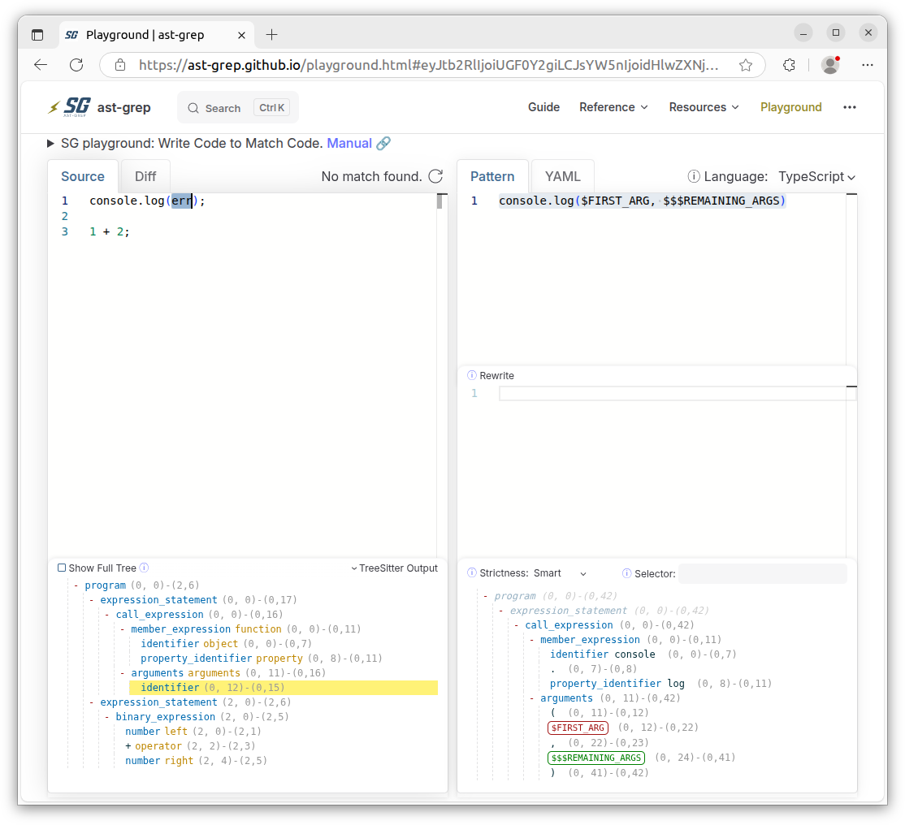
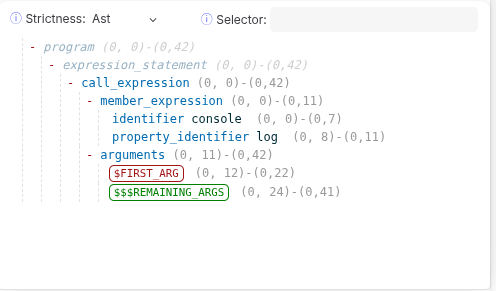
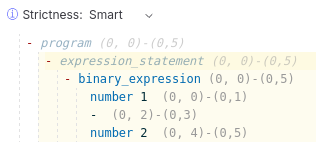

# Workshop: Taking back control of your code
(continues where [02-traditional-search.md](./02-traditional-search.md) file ended)

## Introducing structural search with ast-grep
As shown in the previous section of this workshop, searching for code constructs (e.g., a function call) can be
troublesome using literal text and especially with regex.

This is where the tool ast-grep comes into play.
The ast-grep tool parses your code into an Abstract Syntax Tree (AST), similar to what is done by a compiler,
linting tools (e.g. ESLint, CheckStyle, Ktlint) and code migration tools (e.g., jscodeshift, OpenRewrite).

But, unlike most linting or migration tools, ast-grep does not necessarily require you to have too much in-depth knowledge about how your source code is represented as an AST tree.
Using ast-grep, we can simply use code to find code.

This is called **structural search** and offers a less error-prone alternative to traditional textual search that:
- works no matter how your code is formatted (e.g., code divided across multiple lines).
- always matches the correct closing bracket.

### Searching code using structural search
In this section, we’ll experiment with simple patterns to get a feel for how ast-grep works in practice.

First, make sure the most recent CLI version of ast-grep is installed as explained in the [Installation](https://ast-grep.github.io/guide/quick-start.html#installation) instructions on their website.

💡 **NOTE** when installing ast-grep using NPM, make sure to run `npm install @ast-grep/cli` and **not** ast-grep
(a completely different NPM package that was last published 8 years ago).

🧪 Let's use ast-grep to search for `console.log` calls:
```sh
ast-grep --pattern 'console.log()' ../src
```

Notice that ast-grep only found `console.log` calls **without** arguments.

✅ *Conclusion:* ast-grep can precisely match patterns even when parentheses are empty, avoiding false positives that regex might produce.

🧪 Now try the following:
```sh
ast-grep --pattern 'console.log($ARG)' ../src
```

The search results now only includes `console.log` calls with **exactly** one argument.
But notice that in the `src/common/string/filter/filter.ts` file the second `)` is now actually included in the search matches.
Regex, eat your heart out!

Additionally, the output of `ast-grep --pattern` is much nicer than our `regex-search.sh` since it offers more context,
showing the full line of code with matched results highlighted in red.

✅ *Conclusion:* Using meta-variables allows structural search to handle syntax-aware context gracefully.

🧪 Now let's try to find all `console.log` calls with two arguments:
```sh
ast-grep --pattern 'console.log($ARG, $ARG)' ../src
```

Somehow our search for `console.log` calls with two arguments does **not** seem to work 😕

### Introducing meta-variables
To understand why `ast-grep --pattern 'console.log($ARG, $ARG)'` returns no matches, we must first understand what **meta-variables** are in ast-grep and how they work.
As you might have guessed, the `$ARG` in our search pattern is a meta-variable.

To distinguish meta-variables from actual code syntax, every meta-variable must follow a distinct naming convention:

* every meta-variable must start with one, two or three **expando character(s)**
* `$` is used as the expando character in most languages
* after the expando character(s), only upper-case letters (`A-Z`), underscores (`_`) or digits (`1-9`) are allowed

A meta-variable like `$ARG` in our `console.log` pattern allows you to match against dynamic content.
In this case, the `$ARG` meta-variable uses a single `$` expando character and therefore matches a **single named** AST node.
Using `$$$` (triple) expando characters (e.g. `$$$ARGS`) matches **zero or more unnamed and named** AST nodes.

💡 **NOTE** a meta-variable with `$$` (double) expando characters matches a **single unnamed or named** AST node, but is rarely used in practice.

### Capturing meta-variables
Besides matching against dynamic content, meta-variables can also **capture** the matched content.

And this explains why our earlier command returns no matches — since we used `$ARG` twice, it only matches if both arguments are identical.

To fix this, use unique names for each meta-variable:
```sh
ast-grep --pattern 'console.log($ARG1, $ARG2)' ../src
```

Or, alterative we could place a `_` after the pseudo character(s) to use a
["non"-capturing meta-variable](https://ast-grep.github.io/guide/pattern-syntax.html#non-capturing-match):
```sh
ast-grep --pattern 'console.log($_ARG, $_ARG)' ../src
```

Or skip the name altogether:
```sh
ast-grep --pattern 'console.log($_, $_)' ../src
```

💡 **NOTE** the syntax in Opengrep, that we'll use later in this workshop, for a (single) meta-variable is exactly the
same as the syntax in ast-grep, **except** for `$_ARG` that in Opengrep is
[**not anonymous**](https://semgrep.dev/docs/writing-rules/pattern-syntax#anonymous-metavariables) and therefore does
capture its AST node.

### Matching (and capturing) against multiple AST nodes
The `console.log` function is called with a variable number of arguments in our code base.

Therefore, we need to use `$$$` (triple) expando characters so ast-grep matches against **zero or more** unnamed and named AST nodes:
```sh
ast-grep --pattern 'console.log($$$ARGS)' ../src
```

You can also skip the name entirely:
```sh
ast-grep --pattern 'console.log($$$_)' ../src
```

✅ *Conclusion:* The triple `$` allows flexible matching for variadic argument lists.

### Quirkyness of structural search in ast-grep
Although the structural search of ast-grep is very powerful, it also might behave in unexpected ways.
This is mostly since structural search in ast-grep does strict matching against the AST tree when using structural search.

### Unexpected strict matching of unnamed AST nodes

Given prior experience with variable arguments in languages like JavaScript, TypeScript, and Java, you might assume
searching for `console.log` calls with one or more arguments would be as simple as:
```sh
ast-grep --pattern 'console.log($FIRST_ARG, $$$REMAINING_ARGS)' ../src
```

But notice that none of the `console.log` calls in the results have a single argument.
I even reported a [bug](https://github.com/ast-grep/ast-grep/issues/2234) about this on GitHub.

As it turns out, with the default `smart` strictness, ast-grep matches **all unnamed AST nodes** strictly — even punctuation such as `,`.

To fix this, either:
1. lower the pattern strictness to `ast` (less strict but can cause surprises), or
2. use a YAML rule that includes both `console.log($FIRST_ARG, $$$REMAINING_ARGS)` and `console.log($FIRST_ARG)` patterns.

Let’s add `--strictness ast` and see how single-argument calls now appear in results:
```sh
ast-grep --pattern 'console.log($FIRST_ARG, $$$REMAINING_ARGS)' --strictness ast ../src
```

💡 **NOTE** Using strictness other than `smart` is often error-prone and should only be done when you fully understand the consequences.

### Using Playground for a deeper understanding of the AST

### Using Playground for a deeper understanding of the CST / AST tree
To really understand howvpattern matching in ast-grep behaves, we'll have to use the on-line Playground of ast-grep.

Open the following URL in your favorite web browser:
https://ast-grep.github.io/playground.html#eyJtb2RlIjoiUGF0Y2giLCJsYW5nIjoidHlwZXNjcmlwdCIsInF1ZXJ5IjoiY29uc29sZS5sb2coJEZJUlNUX0FSRywgJCQkUkVNQUlOSU5HX0FSR1MpIiwicmV3cml0ZSI6IiIsInN0cmljdG5lc3MiOiJzbWFydCIsInNlbGVjdG9yIjoiIiwiY29uZmlnIjoiIyB5YW1sLWxhbmd1YWdlLXNlcnZlcjogJHNjaGVtYT1odHRwczovL3Jhdy5naXRodWJ1c2VyY29udGVudC5jb20vYXN0LWdyZXAvYXN0LWdyZXAvbWFpbi9zY2hlbWFzL3J1bGUuanNvblxuXG5pZDogc2VhcmNoLWNvbnNvbGUtbG9nXG5sYW5ndWFnZTogdHNcbnJ1bGU6XG4gIHBhdHRlcm46IGNvbnNvbGUubG9nKCRGSVJTVF9BUkcsICQkJFJFTUFJTklOR19BUkdTKVxuIiwic291cmNlIjoiY29uc29sZS5sb2coZXJyKTtcblxuMSArIDI7In0=

Notice the pattern `console.log($FIRST_ARG, $$$REMAINING_ARGS)` in the top-right of the Playground and the sample code on the left:


In the bottom right of the Playground, you will see the part of the AST tree that's used for our (structural) search pattern:\


Notice that:
- the unnamed nodes `.` `(` `,` `)` are part of the AST tree of our pattern
- the meta-variables `$FIRST_ARG` and `$$$REMAINING_ARGS` are also part of the AST tree of our pattern

Now change the strictness level to `ast` in the Playground, and notice that the unnamed nodes `.` `(` `,`  `)` are no longer part of the AST tree of our pattern.\


With this change, `console.log(err)` now matches:


Notice that the `;` following `console.log(err)` is not matched.
To understand why:
- first click `Show Full Tree` checkbox of the AST tree in the bottom left of the Playground
- notice that the unnamed AST nodes are now also included in the AST tree
- hover over `expression_statement` and notice that the `;` is actually part of the `expression_statement` AST node,
  and not part of the `call_expression` AST node.

💡 **NOTE** in JavaScript / TypeScript, the `;` is optional for a statement and therefore can be omitted.

There are 2 ways to deal with the trailing `;` in the code:
1.  append `;` after the `console.log($FIRST_ARG, $$$REMAINING_ARGS)` pattern in the top right of the Playground
2.  accept it as it is
3.  use a Strictness of `Relaxed` and additionally specify `expression_statement` as a Selector

Although option 3 might look tempting, personally I'm hesitant to use it because based on the [documentation of the `Relaxed` strictness level](https://ast-grep.github.io/advanced/match-algorithm.html#strictness-table),
I don't really understand what is actually does 🫣

In practice, I prefer to use option 1 **when** `;` usage is required and enforced using a code formatter (e.g., Prettier).

Otherwise, I tend to go for option 2 and simply accept it the way it is.

💡 **NOTE** when rewriting code as part of a (auto) fix you can use `expandEnd: { regex: ';' }` in the `fix` object of
your ast-grep YAML rule to expand the range of the to be replaced code to include the trailing `;`.

## Fiddling with strictness is not the answer
To illustrate why adjusting strictness can be risky, try adding `1 + 2;` to the Playground code.

Change strictness to `smart` and pattern to `$A - $B` — notice it doesn’t match (as expected).


Then switch to `ast` strictness — now it **does** match `1 + 2` unexpectedly!


✅ *Conclusion:* Looser strictness levels may unintentionally match the wrong syntax.

### Accounting for language syntax variations
To match `console.log` calls with one or more arguments, it’s better to explicitly support syntax variations instead of adjusting strictness.

Since the CLI `--pattern` option can’t express multiple alternatives, we’ll use a YAML rule instead.

💡 **NOTE** Although you typically define ast-grep rules in `.yml` / `.yaml` files, you can also use inline YAML via
[`--inline-rules`](https://ast-grep.github.io/guide/rule-config.html#ast-grep-scan-inline-rules).

I've prefilled a YAML rule with the same `console.log($FIRST_ARG, $$$REMAINING_ARGS)` pattern.
Notice that the `console.log` (call) expression in test code is no longer matched.
Since no strictness level is specified in the YAML rule, the default strictness level of `smart` is used.

To be able to specify the strictness level of `ast` we need to change the `pattern` inside the YAML to a
[Pattern Object](https://ast-grep.github.io/guide/rule-config/atomic-rule.html#pattern-object):

```yaml
rule:
  pattern:
    context: console.log($FIRST_ARG, $$$REMAINING_ARGS)
    strictness: ast
```

Since specifying strictness can lead to unexpected matches, we’ll instead provide alternative patterns using the [`any` composite rule](https://ast-grep.github.io/guide/rule-config/composite-rule.html#any):
```yaml
rule:
  any:
    - pattern: console.log($FIRST_ARG, $$$REMAINING_ARGS)
    - pattern: console.log($FIRST_ARG)
```

✅ *Conclusion:* Composite rules allow multiple valid AST variations to be captured safely.

## Advanced Structural Search using Opengrep
⏩ View the next file to continue workshop: [04-opengrep-advanced-structural-search.md](./04-opengrep-advanced-structural-search.md)
