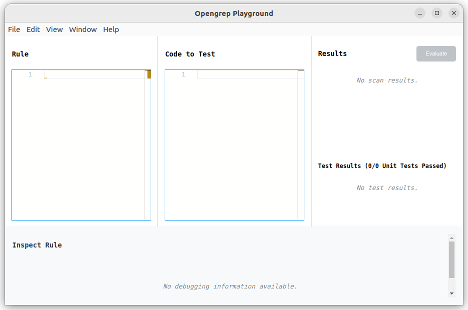

# Workshop: Taking back control of your code
(continues where [03-ast-grep-intro-structural-search.md](./03-ast-grep-intro-structural-search.md) file ended)

## Advanced Structural Search using Opengrep
Although structural search in `ast-grep` is very powerful, it might also behave in unexpected ways.
Mostly since ast-grep does strict matching against the AST tree when using its structural search.

This strict matching might not be what you want when using structural search to find certain code patterns.

Luckily, structured search isn't unique to `ast-grep` and is also available in other tools like [Opengrep](https://semgrep.dev/docs/writing-rules/pattern-syntax#structural-search) (fork from Semgrep CE).

To illustrate why using structural search with ast-grep can be problematic, let's search for `new Set()` :
```sh
ast-grep --pattern 'new Set()' --lang ts ../src
```

Now, do the same structural search with Opengrep:
```sh
opengrep --pattern 'new Set()' --lang ts ../src
```

Notice that the results of Opengrep also includes `new Set<`..`>()` calls (using explicit type arguments).

This is due to the "less-is-more" approach of the structural search implementation of Opengrep.
Given the Static Application Security Testing (SAST) origins, Opengrep / Semgrep wants to include as much applicable search results as possible.

To gain code insights (e.g., as part of "Perfective Software Maintenance"), I personally want to include all possible
syntax variations of a pattern.
In these cases, I personally don't mind that searching with Opengrep is lots slower than with ast-grep.

Now let's search for all the functions with one argument:
```sh
opengrep --pattern 'function $FN($ARG)' --lang ts ../src
```

This will give you "4333 Code Findings" and will take quite a while.
Notice that these search results:

- includes `function ..() {` declarations (e.g., `export function getAllCombinations<T>(arr: T[])`)
- includes methods of classes (e.g., `willUpdate(changedProps: PropertyValues)`)
- includes JavaScript property setters (e.g., `public set value(value: string)`)
- includes constructors (e.g., `constructor(auth?: Auth)`)

Although Structural Search in Opengrep automatically includes lots of syntax variations, it could still miss some syntax variations.
For example, a JavaScript `const `.. variables with an arrow function assigned to it are not included in the search results.

To illustrate this, once again do the previous search but now only for `src/cast/cast_manager.ts`:
```shell
opengrep --pattern 'function $FN($ARG)' --lang ts ../src/cast/cast_manager.ts
```

And now search `const $FN = (...)` in the `src/cast/cast_manager.ts` file:
```shell
opengrep --pattern 'const $FN = function($ARG) { ... }' --lang ts ../src/cast/cast_manager.ts
```

Notice that `const getCastManager = (auth?: Auth) => {`..`}` is now returned in the last search result.

**NOTE**: this example is very JavaScript / TypeScript specific and might not be indicative for incomplete search
results when Opengrep is used for other languages.

## Opengrep Playground
Like ast-grep, Opengrep also has a playground, but unfortunately is not on-line.
But it needs to be installed and run on
your local machine instead.

Install the latest Opengrep Playground for your operating system using the instructions on the README of its GitHub repo:
https://github.com/opengrep/opengrep-playground

Then after installation start it:\


Then copy the contents of the `src/cast/cast_manager.ts` file and paste it into `Code to Test` of the Opengrep Playground.

And then copy the following YAML rule into the `Rule` section of the Opengrep Playground:
```yaml
rules:
  - id: search-all-functions
    languages:
      - typescript
    message: ""
    pattern: function $FN($ARG)
    severity: INFO
```

**NOTE**: the `message` field is required by Opengrep / Semgrep, but since this rule is only used to search I decided to just use an empty string.

Then press the `Evaluate` button in the top-right of the Opengrep Playground, and notice that that search results will be shown in the
`Results` section of the Opengrep Playground in the top-right of the Opengrep Playground.

**NOTE**: OpenGrep Playground is definitely not as mature as the (online) Playground of ast-grep. You might notice it
gives `Something went wrong` popups  when the rule is invalid.
Or alternately, the OpenGrep Playground might just freeze (and then you will have to kill it).

Now let's change the rule so that it either can be `function $FN($ARG)` or `const $FN = function($ARG) { ... }`.
For this, we will wrap a `pattern-either:`  entry around the `pattern: function $FN($ARG)` and then add an extra
`pattern: const $FN = function($ARG) { ... }` to the YAML array:

```yaml
rules:
  - id: search-all-functions
    languages:
      - typescript
    message: ""
    pattern-either:
      - pattern: function $FN($ARG)
      - pattern: const $FN = function($ARG) { ... }
    severity: INFO
```

Press the `Evaluate` button again and notice the `const getCastManager = (auth?: Auth) => {`..`}` is now also included in the search results.

## Corrective Maintenance
⏩ View the next file to continue workshop: [05-corrective-maintenance.md](./05-corrective-maintenance.md)
